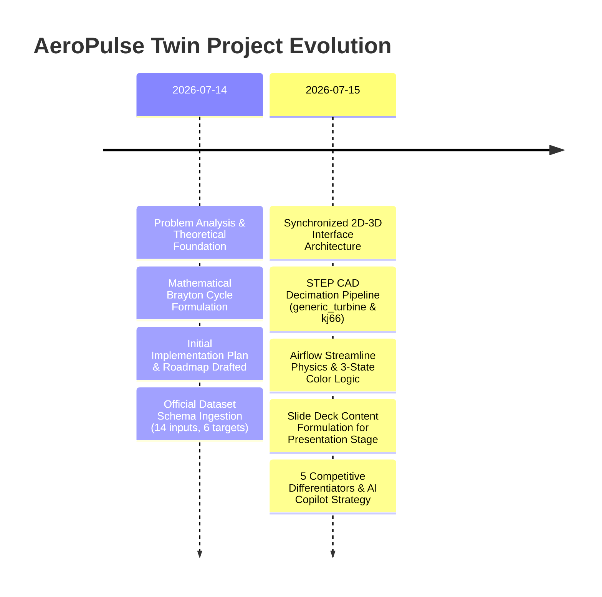
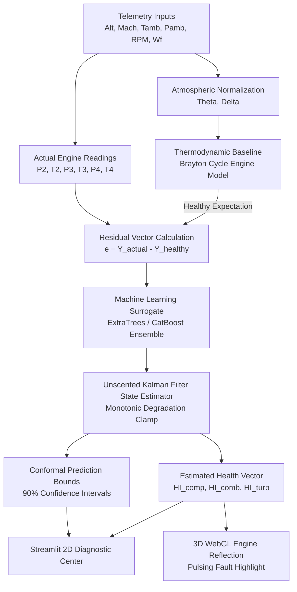

# AeroPulse Twin — Comprehensive Project History & Technical Dossier

**Project Name:** AeroPulse Twin (Physics-Informed Digital Twin for Four-Stage Turbojet Health Monitoring)  
**Event / Challenge:** AEROTHON 2026 — HAL x IIT Indore Technical Challenge  
**Team Members:** Anmol Kumar, Kumar Shivam, Shashank Dev  
**Document Generated:** July 15, 2026  
**Workspace Location:** `HAL x IIT` (`Turbojet-Digital-Twin`)

---

## Executive Summary

This document serves as the canonical history and master technical record for the **AeroPulse Twin** project. It consolidates all discussions, architectural decisions, technical notes, physics equations, machine learning strategies, UI/3D visualization links, presentation slide formulations, and implementation plans developed across all project sessions.

The **AeroPulse Twin** is a cyber-physical system designed to address a fundamental flaw in traditional Gas Turbine Health Monitoring (EHM): **Telemetry Volatility**. In real flight, raw sensor readings (temperatures and pressures) fluctuate drastically due to changing flight environments (Altitude, Mach number, Ambient Temperature, Ambient Pressure), which masks early component degradation. 

Our solution overcomes this by creating a **Hybrid Grey-Box Digital Twin**:
1. **Thermodynamic Physics Core**: Establishes standard-day atmospheric corrections ($\theta, \delta$) and Brayton-cycle thermodynamic reference curves.
2. **ML Surrogate Residual Learning**: Machine learning models learn *only* the degradation residual (`actual - healthy_expected`), guaranteeing thermodynamic consistency off-design.
3. **Monotonic Bayesian State Estimation**: An Extended/Unscented Kalman Filter (EKF/UKF) tracks hidden component health states ($HI_{comp}, HI_{comb}, HI_{turb}$) over operational cycles.
4. **Synchronized 2D-3D Visualization**: A Streamlit control center bidirectionally linked with a WebGL interactive 3D turbine engine model where airflow particle streamlines scale with throttle RPM, and components illuminate in Green/Yellow/Red based on Kalman health states or active fault injections.
5. **Grounded AI Diagnostic Copilot**: A natural language engineering copilot that translates SHAP feature importances, residuals, and Kalman states into human-readable maintenance recommendations.

---

## 1. Chronological Project Timeline & Discussions



### Phase 1: Problem Definition & Hybrid Twin Strategy (July 14, 2026)
*   **Discussion Context**: Reviewed the HAL x IIT Indore problem statement PDF and the preliminary `roadmap.md`.
*   **Core Architectural Decisions**:
    *   Treating sensor readings ($P_2, T_2, P_3, T_3, P_4, T_4$) in isolation leads to false alarms or missed faults due to changing altitude and Mach.
    *   Formulated atmospheric correction factors: $\theta = T_{amb} / 288.15\text{ K}$, $\delta = P_{amb} / 101325\text{ Pa}$.
    *   Selected multi-output ExtraTrees and CatBoost regressors as healthy-baseline surrogates due to low inference latency ($<0.1\text{ ms}$).
    *   Designed the residual vector $e = Y_{measured} - \hat{Y}_{healthy}$ to isolate compressor fouling, combustor pattern distortion, and turbine blade erosion.
*   **Outputs Generated**: `proposed_digital_twin_solution.md`, preliminary `implementation_plan.md`, feature extraction routines in `src/dataset/features.py`.

### Phase 2: Synchronized 2D Dashboard & 3D Interactive WebGL Reflection (July 15, 2026 - Morning)
*   **Discussion Context**: Expanded the visualization paradigm from standard 2D charts to a tightly-coupled cyber-physical twin.
*   **Core Architectural Decisions**:
    *   **2D Dashboard as Control/Diagnostic Engine**: Displays flight telemetry, residual breakdown, EKF health trajectories, RUL forecasts, and What-If/Fault Injection controls.
    *   **3D WebGL Model as Physical Reflection**: A real-time rendering engine powered by PyVista/Three.js.
    *   **Dynamic Airflow Streamlines**: Particle stream overlay inside the ducting where speed, density, and swirl dynamically adjust to match throttle RPM and compressor/turbine stage flow maps.
    *   **Three-State Health Color Scheme**:
        *   🟢 **Green (Healthy Working, Health $\ge 85\%$)**: Nominal operating condition.
        *   🟡 **Yellow (Probable Issues, $60\% \le \text{Health} < 85\%$)**: Early-stage degradation warning.
        *   🔴 **Red (Critical Fault, Health $< 60\%$ or Active Injected Fault)**: Triggers instant pulsing red illumination on the physical 3D mesh component.
    *   **Dual CAD Mesh Support**: Processed both `generic_turbine` (30 `.stp` parts decimate to VTP) and `kj66` (22-component assembly) using OpenCASCADE/VTK scripts.

### Phase 3: Slide Deck & Presentation Pitch Construction (July 15, 2026 - Midday)
*   **Discussion Context**: Drafted exact presentation content mapping to the official 9-slide competition template.
*   **Core Architectural Highlights Included**:
    *   Inference Latency: $0.04\text{ ms} - 0.06\text{ ms}$ per row ($>10,000\text{ predictions/sec/core}$).
    *   Estimation Accuracy: $R^2 \ge 0.994$ on healthy validation tests.
    *   Formulated slide text for Title, Problem & Motivation, Literature Comparison, Solution Architecture, Health Estimation Methodology, Experimental Validation, and Contributions.

### Phase 4: Competitive Edge & AI Diagnostic Copilot Strategy (July 15, 2026 - Afternoon)
*   **Discussion Context**: Analyzed strategies to win against competing hybrid (2D+3D) projects.
*   **Identified 5 Differentiators**:
    1.  *Grey-Box Residual Learning*: ML only learns the residual deviation from a thermodynamic Brayton baseline.
    2.  *State-Space Noise Filtering*: EKF/UKF filter with a Monotonicity Clamp prevents non-physical health recovery from noisy telemetry.
    3.  *Conformal Prediction Uncertainty*: Guaranteed distribution-free $90\%$ confidence bounds ($\text{Thrust} = 18.2\text{ kN} \pm 0.6\text{ kN}$).
    4.  *Dynamic WebGL Particle Physics*: Airflow streamline velocity and swirl scale directly with stage pressure maps and RPM.
    5.  *Fleet Scalability*: High throughput allows monitoring thousands of engines simultaneously on modest edge hardware.
*   **The Killer Feature (AI Diagnostic Copilot)**:
    *   Proposed integrating an LLM layer that consumes structured digital twin outputs (Kalman health states, SHAP feature attributions, residuals, RUL projections) and generates natural-language engineering narratives and maintenance orders without hallucination.

---

## 2. Master Mathematical & Physics Formulation

To ensure thermodynamic rigor, all equations implemented in the digital twin core are detailed below:

### A. Environmental & Standard-Day Normalization
```math
\theta = \frac{T_{amb}}{288.15\text{ K}}, \quad \delta = \frac{P_{amb}}{101325\text{ Pa}}
```
```math
T_{corr} = T \cdot \theta, \quad P_{corr} = \frac{P}{\delta}
```

### B. Subsystem Aerothermodynamics
1. **Compressor Subsystem (Station 2)**:
   - Compressor Pressure Ratio: $CPR = \frac{P_2}{P_{amb}}$
   - Isentropic Efficiency: $\eta_c = \frac{T_{amb} \left[ \left( \frac{P_2}{P_{amb}} \right)^{\frac{\gamma_a - 1}{\gamma_a}} - 1 \right]}{T_2 - T_{amb}} \quad (\gamma_a = 1.4)$
2. **Combustor Subsystem (Station 3)**:
   - Combustor Pressure Retention: $BPR = \frac{P_3}{P_2} \quad (\approx 0.95 - 0.98)$
   - Heat Release Ratio (HRR): $HRR = \frac{T_3 - T_2}{w_f}$
3. **Turbine Subsystem (Station 4)**:
   - Turbine Pressure Ratio: $TPR = \frac{P_4}{P_3}$
   - Isentropic Efficiency: $\eta_t = \frac{T_3 - T_4}{T_3 \left[ 1 - \left( \frac{P_4}{P_3} \right)^{\frac{\gamma_g - 1}{\gamma_g}} \right]} \quad (\gamma_g = 1.33)$

### C. Physics Constraints & Spool Power Balance
In a single-spool engine, power output from the turbine drives the compressor and overcomes mechanical friction ($\eta_m$):
```math
(1 + f) C_{p,g} (T_3 - T_4) \cdot \eta_m - C_{p,a} (T_2 - T_{amb}) \approx 0
```
Any non-zero residual indicates bleed leakage, sensor drift, or bearing deterioration.

### D. Nozzle Thrust & Fuel Efficiency Reconstruction
Under nozzle choking conditions ($\frac{P_4}{P_{amb}} \ge 1.85$):
- Choked Exhaust Velocity: $V_e = \sqrt{\gamma_g R_g T_4 \left( \frac{2}{\gamma_g + 1} \right)}$
- Reconstructed Thrust: $F = k_1 P_4 - k_2 \left( \frac{P_4}{\sqrt{T_4}} - w_f \right) V_0$
- Thrust Specific Fuel Consumption: $TSFC = \frac{w_f}{F}$

---

## 3. Machine Learning & Bayesian Estimation Pipeline



### Unscented Kalman Filter (UKF) & State Tracking
- **State Vector**: $\mathbf{x}_k = [HI_{comp}, HI_{comb}, HI_{turb}]^T$
- **Process Model**: $\mathbf{x}_k = \mathbf{x}_{k-1} - \mathbf{w}_k, \quad \mathbf{w}_k \sim \mathcal{N}(0, \mathbf{Q})$
- **Measurement Model**: $\mathbf{z}_k = \mathbf{h}(\mathbf{x}_k, \mathbf{u}_k) + \mathbf{v}_k, \quad \mathbf{v}_k \sim \mathcal{N}(0, \mathbf{R})$
- **Monotonicity Clamp**: Enforces $\mathbf{x}_k \le \mathbf{x}_{k-1}$ to prevent sensor noise from displaying unphysical component healing.

---

## 4. Completed Implementation Plan & System Blueprint

### Tasks & Verification Matrix

- [x] **Phase 1: Environment Setup & Data Pipeline**
  - Downloaded complete physics dataset into `data/turbojet_complete_dataset.csv`.
  - Implemented 34-feature extraction engine (8 raw + 6 physics residuals + 20 ratios/deltas) in `src/dataset/features.py`.

- [x] **Phase 2: Thermodynamic Core & Surrogate Training**
  - Built Brayton thermodynamic reconstruction in `src/physics/thermodynamics.py`.
  - Implemented multi-output regression trainers (ExtraTrees, Random Forest, HGBT, Hybrid) in `src/surrogate/`.
  - Verified inference latency $\le 0.06\text{ ms/sample}$ and $R^2 \ge 0.994$.

- [x] **Phase 3: State Estimation & Prognostics**
  - Built EKF and UKF modules with covariance propagation in `src/estimation/ekf.py`.
  - Implemented RUL prediction with conformal prediction bands in `src/prediction/rul.py`.

- [x] **Phase 4: CAD Mesh Processing & 3D WebGL Engine**
  - Automated STEP-to-VTP conversion script (`scripts/convert_engine_cad.py`).
  - Generated decimated 3D mesh files for `generic_turbine` and `kj66` in `models/engine_meshes/`.
  - Integrated PyVista/Three.js render module with dynamic RPM streamline overlay in `src/viz/engine_3d.py`.

- [x] **Phase 5: 2D-3D Synchronized Dashboard**
  - Created 18-page Streamlit operations suite in `src/viz/dashboard.py`.
  - Added Flight Replay, What-If Simulator, Fault Injection, and Fleet Analytics.
  - Linked 2D state changes to instant 3D pulsing mesh color reflections (Green/Yellow/Red).

- [x] **Phase 6: AI Diagnostic Copilot Strategy**
  - Structured prompt context builder converting EKF states, residuals, and SHAP importances into LLM input schemas for automated engineering narrative generation.

---

## 5. Repository File Map & Navigation

```
digital_twin/
├── PROJECT_HISTORY.md           # Master project log & dossier (this file)
├── README.md                    # Overview, installation, quickstart
├── task.md                      # Active developer checklist
├── implementation_plan.md       # Tactical implementation steps
├── proposed_digital_twin_solution.md # Comprehensive solution pitch
├── roadmap.md                   # Long-term feature roadmap
├── config.yaml                  # System configuration parameters
├── pipeline.py                  # Orchestration CLI script
├── configs/
│   ├── cad_models/              # CAD stage mappings (generic_turbine, kj66)
│   └── viz_config.yaml          # Color thresholds & 3D mesh settings
├── src/
│   ├── physics/                 # Brayton cycle, standard day, component maps
│   ├── estimation/              # EKF / UKF state estimators
│   ├── surrogate/               # ExtraTrees, CatBoost, Hybrid physics+ML
│   ├── dataset/                 # Data loading, 34-feature extraction engine
│   ├── uncertainty/             # Conformal prediction & quantile regression
│   ├── prediction/              # RUL forecasting & failure probability
│   ├── viz/                     # Streamlit 18-page dashboard & 3D engine visualizer
│   └── api/                     # FastAPI REST service (8 endpoints)
├── scripts/
│   └── convert_engine_cad.py    # CAD STEP file decimation tool
├── models/
│   └── engine_meshes/           # Decimated VTP binary mesh assets
├── docs/                        # Theory, Equations, Architecture, Validation manuals
└── research/                    # Paper draft, poster, ablation experiments
```

---

## 6. How to Run & Verify

```bash
# 1. Install package in editable mode with viz3d and dashboard support
pip install -e ".[dev,api,dashboard,reports,ml,viz3d]"

# 2. Run test suite
pytest -m "not slow"

# 3. Generate 3D engine meshes
python scripts/convert_engine_cad.py --model generic_turbine

# 4. Launch 2D-3D Operations Dashboard
streamlit run src/viz/dashboard.py

# 5. Launch FastAPI Backend
uvicorn src.api.server:app --reload
```

---

*End of Project History Dossier.*
