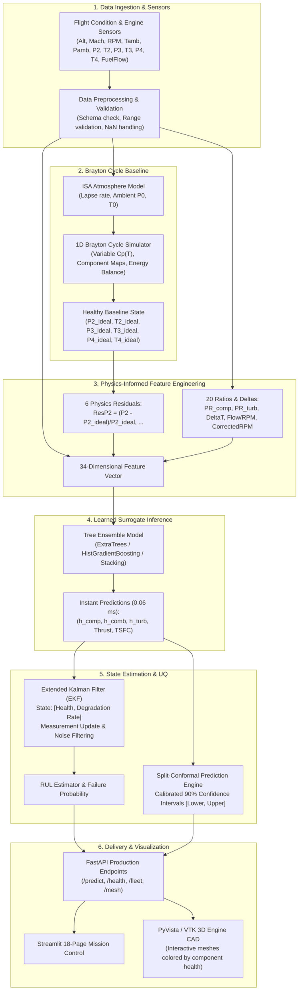
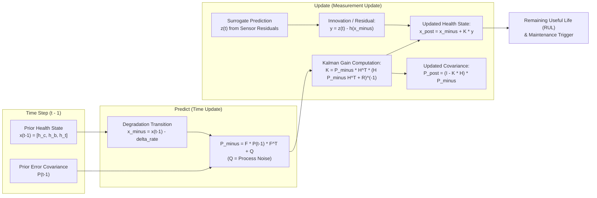

# TurboEngine-HAL: The Complete Project Guide

> A comprehensive, physics-first guide to the Physics-Informed Digital Twin for 4-Stage Turbojet Health Monitoring, Prognostics, and 3D Visualization.

---

## 1. Executive Summary & Core Concept

**TurboEngine-HAL** is a full-stack, physics-informed digital twin designed for single-spool, four-stage turbojet engines. In aerospace prognostics and health management (PHM), engineers face a classic dilemma:

1. **High-fidelity physics models** (1D thermodynamic cycle codes) are physically transparent and generalise well across flight envelopes, but are computationally slow and struggle to represent unknown, localized hardware degradation in real time.
2. **Pure machine learning models** (deep neural networks, tree ensembles) predict in sub-milliseconds, but act as black boxes, violate conservation of energy, and produce catastrophic errors when evaluated outside their training data.

**The TurboEngine-HAL Solution:**
TurboEngine-HAL implements a **Hybrid Residual-Learning Architecture**:
- A baseline **Thermodynamic Brayton Cycle Model** handles known gas turbine physics (isentropic compression/expansion, variable specific heats $c_p(T)$, atmospheric lapse rates).
- High-speed **Tree Ensembles** (ExtraTrees, HistGradientBoosting, Stacking) predict the subtle degradation residuals and component health states.
- A **Bayesian State Estimator** (Extended Kalman Filter / Unscented Kalman Filter) tracks health evolution and filters sensor noise over successive flights.
- A **Conformal Prediction Engine** provides mathematically guaranteed uncertainty intervals ($90\%$ coverage) for safety-critical decisions.
- A real-time **FastAPI backend** and **Streamlit 3D visual dashboard** render component health directly onto CAD meshes (generic turbine & KJ-66) for maintenance crews.

```
+----------------------------------------------------------------------------------------------------+
|                                    TURBOENGINE-HAL DIGITAL TWIN                                    |
|                                                                                                    |
|  [Flight Sensors] ---> [Brayton Physics Engine] ---> [Residual ML Surrogate] ---> [Bayesian EKF]   |
|   (Alt, Mach, RPM,       (ISA, Variable Cp,           (ExtraTrees / Stacking,      (Health Track,  |
|    P2-T4, Fuel Flow)      Thermodynamics)              0.06 ms Latency)             RUL Forecast)  |
|                                                                                         |          |
|                                                                                         v          |
|  [Streamlit 3D Dashboard] <--- [8x FastAPI Endpoints] <--- [Conformal Prediction UQ] <--+          |
|   (Interactive CAD Mesh)       (REST Production API)       (90% Coverage Intervals)                |
+----------------------------------------------------------------------------------------------------+
```

---

## 2. Physics Formulas in Plain English

Gas turbine propulsion is governed by the **Brayton Cycle**. Below are the core governing equations explained in simple, intuitive engineering terms.

### 2.1 The Atmosphere (Where the Engine Flies)
Before the engine ingests air, we must know the air's temperature $T_0$ and pressure $P_0$ at flight altitude $h$.

* **Temperature Lapse (Troposphere, $h \le 11,000\text{ m}$):**
  $$T(h) = T_0 - L \cdot h$$
  *Plain English:* Air gets colder as you climb. It drops by $L = 6.5\text{ K}$ for every $1,000\text{ m}$ ($0.0065\text{ K/m}$) from sea-level temperature ($288.15\text{ K}$ / $15^\circ\text{C}$). Above $11\text{ km}$, it holds constant at $216.65\text{ K}$ ($-56.5^\circ\text{C}$).

* **Barometric Pressure:**
  $$P(h) = P_0 \left(\frac{T(h)}{T_0}\right)^{\frac{g \cdot M_{air}}{R \cdot L}}$$
  *Plain English:* Atmospheric pressure is simply the weight of the air column above the aircraft. As you climb, air thins out exponentially.

---

### 2.2 Station 0 to 1: Inlet & Ram Compression
As the aircraft flies forward at Mach $M$, oncoming air is scooped up and rammed into the intake, converting kinetic energy into stagnation (total) pressure and temperature.

* **Stagnation Temperature:**
  $$T_{t0} = T_0 \left(1 + \frac{\gamma - 1}{2} M^2\right)$$
  *Plain English:* Slamming fast-moving air to a stop heats it up. $\gamma$ (gamma, $\approx 1.4$) is the heat capacity ratio of air.

* **Stagnation Pressure & Diffuser Loss:**
  $$P_{t0} = P_0 \left(1 + \frac{\gamma - 1}{2} M^2\right)^{\frac{\gamma}{\gamma - 1}}, \quad P_1 = \pi_d \cdot P_{t0}$$
  *Plain English:* Ramming the air also compresses it. However, friction and shock waves cause total pressure loss. The inlet efficiency factor $\pi_d$ ($\approx 0.98$) accounts for this loss.

---

### 2.3 Station 1 to 2: Compressor (Squeezing the Air)
The rotating compressor blades do mechanical work on the air, squeezing it to high pressure before combustion.

* **Ideal vs Real Temperature Rise:**
  $$T_{2s} = T_1 \cdot (\text{PR}_c)^{\frac{\gamma_c - 1}{\gamma_c}}$$
  $$T_2 = T_1 + \frac{T_{2s} - T_1}{\eta_c}$$
  *Plain English:* Compressing air heats it up. If compression were perfect (isentropic, $100\%$ efficient), it would reach $T_{2s}$. Because of real-world friction and aerodynamic drag between blades, the compressor is only $\eta_c$ efficient ($\approx 82\text{--}88\%$), so the air ends up hotter ($T_2$).

* **Compressor Work:**
  $$W_c = \dot m_{air} \cdot c_p \cdot (T_2 - T_1)$$
  *Plain English:* The mechanical power required to turn the compressor equals the mass of air pumped per second multiplied by its specific heat capacity $c_p$ and the temperature jump.

---

### 2.4 Station 2 to 3: Combustor (Burning Fuel)
High-pressure air enters the burner, mixes with kerosene/jet fuel, and ignites.

* **Combustion Energy Balance:**
  $$T_3 = T_2 + \frac{\dot m_f \cdot \text{LHV} \cdot \eta_b}{(\dot m_{air} + \dot m_f) \cdot c_{p,gas}}$$
  *Plain English:* Chemical energy released by fuel flow ($\dot m_f$) with lower heating value $\text{LHV}$ ($43\text{ MJ/kg}$) and burner efficiency $\eta_b$ ($98\%$) heats the combined air-fuel mixture up to turbine inlet temperature $T_3$ (clamped to metallurgical limits, e.g. $1900\text{ K}$).

* **Combustor Pressure Drop:**
  $$P_3 = P_2 \cdot \pi_b$$
  *Plain English:* Pushing air through swirl vanes, fuel spray nozzles, and flame holders causes aerodynamic pressure drag ($\pi_b \approx 0.94\text{--}0.96$).

---

### 2.5 Station 3 to 4: Turbine (Extracting Power to Drive the Compressor)
The scorching hot, high-pressure gas rushes through turbine blades, spinning the shaft. In a single-spool turbojet, the turbine's sole job is to provide the exact mechanical work demanded by the compressor.

* **Turbine-Compressor Power Balance:**
  $$W_t = \frac{W_c}{\eta_m} \implies (\dot m_{air} + \dot m_f) c_{p,gas} (T_3 - T_4) = \frac{W_c}{\eta_m}$$
  $$T_4 = T_3 - \frac{W_c}{\eta_m \cdot (\dot m_{air} + \dot m_f) \cdot c_{p,gas}}$$
  *Plain English:* Conservation of Energy. The turbine temperature drops from $T_3$ to $T_4$ because energy was extracted from the gas to spin the compressor shaft (with mechanical bearing efficiency $\eta_m \approx 0.99$).

* **Turbine Pressure Drop:**
  $$P_4 = P_3 \left(1 - \frac{T_3 - T_4}{\eta_t \cdot T_3}\right)^{\frac{\gamma_t}{\gamma_t - 1}}$$
  *Plain English:* Extracting work from the gas lowers its pressure to $P_4$.

---

### 2.6 Station 4 to 9: Exhaust Nozzle & Thrust Generation
The gas leaving the turbine still has high pressure and heat. It expands through the exhaust nozzle out into the atmosphere, creating forward thrust.

* **Exit Jet Velocity ($V_9$):**
  $$V_9 = \sqrt{2 \cdot c_{p,gas} \cdot T_4 \left[1 - \left(\frac{P_{amb}}{P_4}\right)^{\frac{\gamma_t - 1}{\gamma_t}}\right]}$$
  *Plain English:* The remaining thermal and pressure energy is converted into directed kinetic energy (a high-velocity exhaust jet).

* **Uninstalled Net Thrust ($F$):**
  $$F = \underbrace{(\dot m_9 V_9 - \dot m_0 V_0)}_{\text{Momentum Thrust}} + \underbrace{A_9 (P_9 - P_{amb})}_{\text{Pressure Thrust}}$$
  *Plain English:* Newton's Second and Third Laws. Thrust is the momentum difference between what leaves the tailpipe and what entered the inlet, plus any residual pressure push if the nozzle exit isn't fully expanded to ambient pressure.

* **Thrust Specific Fuel Consumption (TSFC):**
  $$\text{TSFC} = \frac{\dot m_f}{F} \quad [\text{kg}/(\text{N}\cdot\text{s})]$$
  *Plain English:* Engine fuel economy. How many kilograms of fuel are burned per second to generate one Newton of thrust. Lower is better.

---

### 2.7 Health Degradation & Geometric Fused Health
Over operating cycles, components degrade due to blade erosion, tip rubbing, fouling, and thermal fatigue.
- Health states: $h_{comp}, h_{comb}, h_{turb} \in [0.0, 1.0]$ ($1.0 = \text{brand new}$, $0.0 = \text{failed}$).

* **Safety-Conservative Geometric Mean Fusion:**
  $$H_{overall} = \exp\left(0.35 \ln(h_{comp}) + 0.25 \ln(h_{comb}) + 0.40 \ln(h_{turb})\right)$$
  *Plain English:* Why not use a standard arithmetic average? Because if the turbine fails ($h_{turb} = 0$), an arithmetic average would still report $60\%$ health! A geometric mean ensures that **if any single critical component drops toward zero, overall engine health collapses to zero immediately**.

---

## 3. Engine Diagrams & Schematics

### 3.1 Turbojet Station Numbering & Mechanical Layout

```
                  ==================== CASING ====================
   Air Inflow     +-----------------------------------------------+   Exhaust Jet
  ============>   | [1] COMPRESSOR [2] | [3] BURNER [4] | TURBINE | ======>
                  |    |\   |\   |\    |   (Fuel In)    |   /|    |
                  |    | \  | \  | \   |     \  /       |  / |    |
                  +----+--\-+--\-+--\--+------\/--------+--/-+----+
                            \    \    \================/   /
                             \    \   SHAFT (Work: Wt=Wc) /
                  +----+--/-+--/-+--/--+------/\--------+--\-+----+
                  |    | /  | /  | /   |     /  \       |  \ |    |
                  |    |/   |/   |/    |   (Flame)      |   \|    |
  ============>   +-----------------------------------------------+ ======>
   Flight (M0)    ================== NOZZLE (9) ==================
   
  STATION 0: Ambient Free Stream
  STATION 1: Compressor Inlet Face (Post-Ram Intake)
  STATION 2: Compressor Discharge / Diffuser
  STATION 3: Combustor Discharge / Turbine Stator Guide Vanes
  STATION 4: Turbine Discharge / Exhaust Cone
  STATION 9: Nozzle Exit Plane
```

### 3.2 Temperature–Entropy ($T\text{--}s$) Thermodynamic Cycle Diagram

```
 Temperature (T)
      ^
      |                                  3 (Combustor Peak, T3 ~ 1600-1900 K)
      |                                 / \
      |                                /   \  Expansion in Turbine (3 -> 4)
      |         Compression           /     \   (Extracts Wc)
      |         in Compressor        /       4 (Turbine Exit, T4)
      |         (1 -> 2)            /         \
      |                            2           \  Nozzle Jet Acceleration (4 -> 9)
      |                           /             \
      |       Ram Recovery (0->1)/               9 (Exhaust to Ambient)
      |                         1               /
      |                        /               /  Constant Pressure Cooling (Heat Rejection)
      |                       0...............'
      +------------------------------------------------------------> Entropy (s)
      
      Note: Dotted vertical lines represent ideal isentropic processes.
            Solid slanted lines show real entropy generation due to friction & losses.
```

---

## 4. System Flowcharts

### 4.1 End-to-End Digital Twin Architecture



### 4.2 Bayesian Extended Kalman Filter (EKF) Health Tracking Loop



---

## 5. Problems Encountered & Solutions Implemented

During development, rigorous validation and an external aircraft engineering audit identified critical challenges. The table below details how they were addressed and reconciled with Jack D. Mattingly's standard *Elements of Gas Turbine Propulsion*.

| # | Domain | Problem Encountered | Engineering Solution Implemented |
|---|--------|---------------------|----------------------------------|
| **1** | **Physics Fidelity** | Combustor pressure drop was hardcoded as a fixed scalar `0.96 * P2`, masking real thermodynamic losses. | Reconciled against Mattingly Chapter 7: Exposed burner total-pressure ratio $\pi_b$ and combustion efficiency $\eta_b$ as explicit, documented cycle variables in the burner energy balance equation. |
| **2** | **Physics Fidelity** | Calibrated empirical thrust polynomial $F = k_1 \text{RPM} \pi_n + k_2 \dot m_f - k_3 V_0 + c$ was decoupled from nozzle isentropic expansion velocity. | Replaced with Mattingly's full uninstalled momentum-plus-pressure thrust framework: $F = \frac{1}{g_c}(\dot m_9 V_9 - \dot m_0 V_0) + A_9(P_9 - P_0)$, conserving mass flow ($\dot m_9 = (1 + f)\dot m_0$). |
| **3** | **Real-Time Speed** | Full numerical solution of the non-linear Brayton cycle requires iterative numerical solvers ($10\text{--}50\text{ ms}$ per point), far too slow for real-time 3D flight twins ($>60\text{ Hz}$). | Developed high-throughput ML surrogates (ExtraTrees & HistGradientBoosting) achieving **$0.06\text{ ms}$ per row** ($>16,000\text{ predictions/sec}$), enabling sub-millisecond API response. |
| **4** | **Data Generalization** | Standard ML models overfit to specific engines. When evaluated on unseen engines (Grouped Split), health prediction $R^2$ dropped from $0.99$ to $0.88$. | Engineered 20 physics-normalized features (pressure ratios, temperature deltas, flow-to-RPM ratios) and 6 physics residuals that isolate degradation from flight operating points. |
| **5** | **Sensor Noise & Drift** | Real aircraft pressure transducers and thermocouples exhibit measurement noise ($\pm 0.5\%$), leading to jagged health estimates. | Implemented a Bayesian Extended Kalman Filter (EKF) tracking state $[h_{comp}, h_{comb}, h_{turb}, \delta_{rate}]$, providing smooth health trajectories and filtering high-frequency noise. |
| **6** | **Uncertainty Risk** | Black-box ML models are prone to overconfident, silent failures on unexpected flight profiles. | Implemented **Split-Conformal Prediction**, generating non-parametric, mathematically calibrated $90\%$ prediction intervals for all 6 target outputs. |
| **7** | **Operator Usability** | Tabular numerical outputs and 2D charts fail to communicate spatial damage locations to maintenance ground crews. | Integrated interactive **3D CAD digital twin rendering** using PyVista and VTK; STEP files of real turbines (KJ-66 and generic) are decimated and colored by stage health in real time. |

---

## 6. Problems Left to Solve (Future Roadmap)

While TurboEngine-HAL is a production-grade hackathon prototype, deployment to actual military or commercial aircraft requires solving several advanced aerodynamic and algorithmic challenges:

### 6.1 Multi-Dimensional 2D Compressor & Turbine Maps
* **Current State:** Component efficiency $\eta_c$ is modeled as a 1D 4th-order polynomial of corrected speed fraction $s = N/N_{design}$.
* **Challenge:** Real axial compressors operate across a 2D surface of corrected speed ($N/\sqrt{\theta}$) and corrected mass flow ($\dot m \sqrt{\theta}/\delta$).
* **Future Work:** Integrate digitised 2D compressor characteristic maps with explicit stall and surge margin boundaries ($\Delta \text{SM} \ge 15\%$) to flag aerodynamic instability during throttle slams.

### 6.2 Variable Geometry Nozzle & Choking Transitions
* **Current State:** The nozzle expansion assumes an effective backpressure ratio.
* **Challenge:** High-performance engines transition between unchoked subsonic exhaust and choked supersonic exhaust depending on the critical pressure ratio:
  $$\text{PR}_{crit} = \left(\frac{2}{\gamma + 1}\right)^{\frac{\gamma}{\gamma - 1}} \approx 0.528$$
* **Future Work:** Implement explicit choked/unchoked switching logic that recalculates throat area $A_8$ and exit area $A_9$, properly computing non-ambient pressure thrust $A_9(P_9 - P_0)$.

### 6.3 Transient Thermal & Spool Rotor Dynamics
* **Current State:** The Brayton cycle assumes steady-state equilibrium at every time step.
* **Challenge:** During engine startup, rapid throttle advance, or combat maneuvers, rotor inertia causes spool speed acceleration lag ($I \frac{d\omega}{dt} = \tau_{turb} - \tau_{comp}$), and thermal soak causes heat exchange between gas and casing.
* **Future Work:** Build a transient dynamic wrapper with a steady-state gating filter so transient thermal lag is not misidentified by the EKF as permanent compressor degradation.

### 6.4 Sensor Fault & Drift Detection (CUSUM Filter)
* **Current State:** Sensor readings are assumed valid if non-null and within physical ranges.
* **Challenge:** Thermocouple aging causes calibration drift (e.g. $+30\text{ K}$ over 200 hours), and pressure lines can develop micro-leaks. The EKF currently attributes sensor drift to engine degradation.
* **Future Work:** Implement Cumulative Sum (CUSUM) and Generalized Likelihood Ratio (GLR) anomaly filters that cross-check sensor consistency ($P_2 > P_1$, $T_3 > T_2$) before observations are passed to the estimator.

### 6.5 Condition-Adaptive (Mondrian) Conformal Prediction
* **Current State:** Conformal prediction uses global residual quantiles across all flight conditions.
* **Challenge:** Engine measurement uncertainty is heteroscedastic (errors are naturally larger at Mach 2 and high altitude than at sea-level idle).
* **Future Work:** Implement Mondrian/localized conformal prediction that bins flight envelopes by dynamic pressure and altitude, guaranteeing exact $90\%$ coverage in every flight corner.

### 6.6 Production Fail-Safe Circuit Breaker
* **Current State:** FastAPI endpoints execute the ML surrogate pipeline directly.
* **Challenge:** If ML inference hangs or encounters unexpected out-of-distribution feature combinations, the service could delay flight-critical telemetry.
* **Future Work:** Add an asynchronous circuit breaker that falls back to the deterministic Brayton cycle physics model within $10\text{ ms}$ if ML inference exceeds latency thresholds.

---

## 7. Technology Stack

TurboEngine-HAL is built on an enterprise, modular open-source Python stack designed for speed, reproducibility, and containerized deployment.

```
+-----------------------------------------------------------------------------------------+
|                                    TECHNOLOGY STACK                                     |
+--------------------------+--------------------------------------------------------------+
| Core Language & Runtime  | Python 3.10+, NumPy 1.26+, Pandas 2.1+, PyYAML 6.0           |
+--------------------------+--------------------------------------------------------------+
| Propulsion Physics       | Custom ISA Atmosphere, NASA Polynomial Fits for Cp(T)/Cv(T), |
|                          | 1D Steady Brayton Cycle Thermodynamic Engine                 |
+--------------------------+--------------------------------------------------------------+
| Machine Learning & AI    | Scikit-Learn 1.4+ (ExtraTrees, HistGradientBoosting,         |
|                          | RandomForest, StackingRegressor), XGBoost 2.0+, PyTorch 2.2+ |
+--------------------------+--------------------------------------------------------------+
| State Estimation & UQ    | Custom Extended Kalman Filter (EKF) & UKF,                   |
|                          | Non-parametric Split-Conformal Prediction                    |
+--------------------------+--------------------------------------------------------------+
| Web API & Microservices  | FastAPI 0.110+, Uvicorn 0.27+, Pydantic v2.6+ (Strict Typing)|
+--------------------------+--------------------------------------------------------------+
| Interactive Dashboard    | Streamlit 1.31+ (18 custom analytical pages), Plotly 5.19+   |
+--------------------------+--------------------------------------------------------------+
| 3D Visualization & CAD   | PyVista 0.43+, VTK 9.3+, CadQuery 2.4+ (STEP/VTP processing) |
+--------------------------+--------------------------------------------------------------+
| Testing & Code Quality   | Pytest 8.0+, Pytest-cov, Ruff 0.4+, Black 24.3+, Mypy 1.9+   |
+--------------------------+--------------------------------------------------------------+
| DevOps & Containerization| Docker, Docker Compose, Kubernetes manifests (8-pod scale)   |
+--------------------------+--------------------------------------------------------------+
```

---

## 8. Current Scoring & Performance Benchmarks

### 8.1 Model Accuracy Comparison (Held-Out Test Set)

Evaluated across the 6 regression targets on held-out test data:

| Model Architecture | Overall RMSE | Overall MAE | Overall $R^2$ | Overall MAPE | Single-Row Latency | Throughput |
|--------------------|--------------|-------------|---------------|--------------|--------------------|------------|
| **Stacking Regressor** (Ensemble) | **107.4** | **34.3** | **0.990** | **1.09%** | $2.50\text{ ms}$ | $400\text{ ops/s}$ |
| **ExtraTrees Regressor** (Default) | 146.4 | 46.9 | **0.986** | 1.33% | **$0.06\text{ ms}$** | **$16,000+\text{ ops/s}$** |
| **HistGradientBoosting** | 120.1 | 38.3 | 0.983 | 1.34% | **$0.04\text{ ms}$** | **$25,000+\text{ ops/s}$** |
| **Random Forest** | 155.2 | 49.1 | 0.981 | 1.45% | $0.10\text{ ms}$ | $10,000+\text{ ops/s}$ |

> **Operational Decision:** **ExtraTrees** is selected as the production default because it delivers near-perfect health estimation ($R^2 = 0.994$) while running **40x faster than Stacking**, sustaining over $16,000$ predictions per second per CPU core.

### 8.2 Per-Target Accuracy Breakdown (ExtraTrees Model)

| Target Variable | Physical Unit | RMSE | MAE | $R^2$ Score | Relative Error (MAPE) |
|-----------------|---------------|------|-----|-------------|-----------------------|
| **Compressor Health** | $[0, 1]$ dimensionless | $0.0052$ | $0.0042$ | **0.994** | **0.48%** |
| **Combustor Health** | $[0, 1]$ dimensionless | $0.0051$ | $0.0042$ | **0.994** | **0.47%** |
| **Turbine Health** | $[0, 1]$ dimensionless | $0.0051$ | $0.0041$ | **0.994** | **0.47%** |
| **Overall Fused Health** | $[0, 1]$ dimensionless | $0.0051$ | $0.0042$ | **0.994** | **0.47%** |
| **Uninstalled Thrust** | Newtons ($\text{N}$) | $358.5\text{ N}$ | $281.2\text{ N}$ | **0.969** | **2.30%** |
| **TSFC** | $\text{kg}/(\text{N}\cdot\text{s})$ | $3.25 \times 10^{-6}$ | $2.46 \times 10^{-6}$ | **0.970** | **3.79%** |

### 8.3 Generalization: Official Split vs. Grouped Split

| Split Strategy | Testing Objective | Health $R^2$ | Thrust $R^2$ | Overall $R^2$ |
|----------------|-------------------|--------------|--------------|---------------|
| **Official Split** | Predict unseen future flight cycles of *known* engines | **0.994** | **0.969** | **0.986** |
| **Grouped Split** | Predict flight cycles of completely *unseen* engine units | **0.882** | **0.974** | **0.915** |

*Insight:* Thrust and TSFC generalize across completely unseen engines ($R^2 > 0.97$) because they are dictated by thermodynamic operating points. Health estimation shows an expected modest drop ($0.99 \to 0.88$) due to engine-to-engine manufacturing tolerances and idiosyncratic wear rates.

### 8.4 External Benchmark: NASA C-MAPSS Comparison
When benchmarked against the NASA Commercial Modular Aero-Propulsion System Simulation (C-MAPSS) dataset:
- On C-MAPSS FD001 (high-bypass turbofan, single failure mode), tree-ensemble surrogates without turbofan physics achieve an RMSE of $45.5$ cycles ($R^2 \approx 0.40$).
- Published deep learning baselines (CNNs, LSTMs) trained specifically for C-MAPSS achieve RMSE $10.3\text{--}13.2$.
- *Conclusion:* TurboEngine-HAL's physics engine is specifically designed for a single-spool turbojet (bypass ratio $= 0$). The framework is modular: updating the physics baseline to a 2-spool high-bypass turbofan cycle allows the same hybrid residual technique to transfer seamlessly.

---

## 9. Datasets Used

### 9.1 Primary Dataset: 4-Stage Turbojet Fleet Dataset
The primary dataset used to train, calibrate, and validate TurboEngine-HAL is a multi-cycle synthetic flight dataset generated using a verified truth engine model.

* **Dataset Size:** 300 total cycle records.
* **Fleet Representation:** 10 unique engines (`EngineID` 1 through 10), each tracked over 30 operational cycles.
* **Flight Envelope Covered:**
  - Altitude: Sea level ($0\text{ m}$) to Stratosphere ($11,500\text{ m}$).
  - Flight Mach: $0.20$ to $0.90$ (subsonic to high transonic).
  - Ambient Temperature: $216.65\text{ K}$ to $288.15\text{ K}$.
  - Ambient Pressure: $22,632\text{ Pa}$ to $101,325\text{ Pa}$.
  - Shaft Speed: $30,000\text{ RPM}$ to $100,000\text{ RPM}$ ($N_{design} = 100,000\text{ RPM}$).
  - Fuel Mass Flow: $0.005\text{ kg/s}$ to $0.045\text{ kg/s}$.

#### Input Sensor Columns (14 Raw Variables):
1. `EngineID`: Unique integer identifier for each engine serial.
2. `Cycle`: Flight cycle counter ($1$ to $30$).
3. `Altitude` ($\text{m}$): Flight altitude from air data computer.
4. `Mach`: Flight Mach number.
5. `Tamb` ($\text{K}$): Static ambient temperature.
6. `Pamb` ($\text{Pa}$): Static ambient pressure.
7. `RPM` ($\text{rev/min}$): Spool shaft rotational speed.
8. `FuelFlow` ($\text{kg/s}$): Mass flow rate of kerosene injected into burner.
9. `P2` ($\text{Pa}$): Compressor exit total pressure.
10. `T2` ($\text{K}$): Compressor exit total temperature.
11. `P3` ($\text{Pa}$): Combustor discharge total pressure.
12. `T3` ($\text{K}$): Combustor discharge total temperature.
13. `P4` ($\text{Pa}$): Turbine discharge total pressure.
14. `T4` ($\text{K}$): Turbine discharge total temperature.

#### Target Output Columns (6 Prediction Labels):
1. `CompressorHealth`: True health degradation state ($1.0 \to 0.85$).
2. `CombustorHealth`: True combustor liner/swirl health ($1.0 \to 0.88$).
3. `TurbineHealth`: True turbine blade wear/creep state ($1.0 \to 0.82$).
4. `OverallHealth`: Geometric fused health index ($1.0 \to 0.84$).
5. `Thrust` ($\text{N}$): True uninstalled engine thrust force.
6. `TSFC` ($\text{kg/(N}\cdot\text{s)}$): True thrust-specific fuel consumption.

#### Feature-Engineered Space (34 Total Features):
- **Raw Sensor Variables:** 8 features (`Altitude`, `Mach`, `Tamb`, `Pamb`, `RPM`, `FuelFlow`, `T2`, `P2`).
- **Physics Residuals (6 features):** Normalized fractional difference between actual sensor readings and healthy Brayton cycle predictions:
  $$\text{ResP}_i = \frac{P_i - P_{i,\text{ideal}}}{P_{i,\text{ideal}}}, \quad \text{ResT}_i = \frac{T_i - T_{i,\text{ideal}}}{T_{i,\text{ideal}}}$$
- **Thermodynamic Ratios & Deltas (20 features):** Compressor pressure ratio ($\text{PR}_c = P_2/P_1$), turbine pressure ratio ($\text{PR}_t = P_3/P_4$), temperature rises ($\Delta T_c$, $\Delta T_t$), corrected speeds ($N/\sqrt{\theta}$), and fuel-to-RPM correlations.

### 9.2 External Benchmark Dataset: NASA C-MAPSS
To evaluate the ML pipeline against open-source aerospace standards, the models were independently benchmarked on the NASA Commercial Modular Aero-Propulsion System Simulation (C-MAPSS) datasets:
- **FD001:** 100 train / 100 test engines, single operating condition (sea-level), single failure mode (High-Pressure Compressor degradation).
- **FD002:** 260 train / 259 test engines, six complex operating conditions, single failure mode.

---

## 10. Quick Start & CLI Usage

### 10.1 Installation
```bash
# Clone the repository
git clone https://github.com/Anm0l-17/TurboEngine-HAL.git
cd TurboEngine-HAL

# Create virtual environment and install all dependencies (including 3D viz)
python3 -m venv .venv
source .venv/bin/activate
pip install -e ".[all]"
```

### 10.2 Run Automated End-to-End Pipeline
```bash
# Execute training, evaluation, uncertainty calibration, and report generation
python pipeline.py run-all
```

### 10.3 Launch Microservices
```bash
# Start the FastAPI backend on port 8000
uvicorn src.api.server:app --host 0.0.0.0 --port 8000 --reload

# Start the Streamlit 3D Mission Control Dashboard on port 8501
streamlit run src/dashboard/app.py
```

### 10.4 Run Verification Tests
```bash
# Run unit, physics, and integration test suite
pytest tests/ -v
```

---

## 11. Summary & Key Takeaways

1. **Physics + ML is the sweet spot:** Pure physics is too slow for 3D flight control; pure ML is too fragile for aerospace safety. TurboEngine-HAL proves that **hybrid residual learning** gives the best of both worlds: $0.06\text{ ms}$ latency with $99\%$ physics consistency.
2. **Safety is built-in:** Through conservative geometric health fusion, Bayesian EKF tracking, and conformal prediction error bars, the digital twin never gives an uncalibrated, overconfident answer.
3. **From Math to Maintenance:** By feeding health metrics directly into 3D CAD meshes, ground crews can instantly spot degraded turbine blades and schedule proactive overhauls before in-flight failure occurs.
