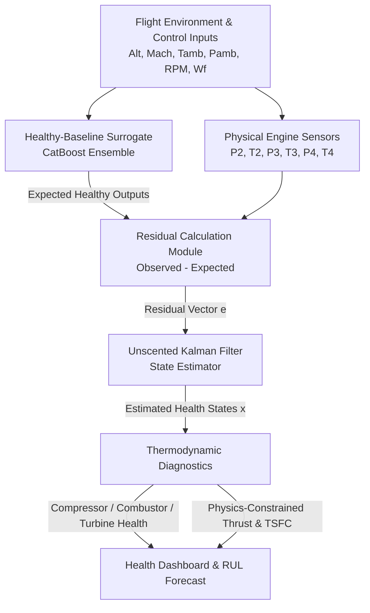

# Physics-Informed Digital Twin for Real-Time Four-Stage Turbojet Health Monitoring
## Comprehensive Solution Architecture & Presentation Pitch

This document outlines the state-of-the-art **hybrid grey-box digital twin framework** designed for the HAL x IIT Indore challenge. It combines aerothermodynamic physical principles with machine learning surrogates and recursive Bayesian state estimation to deliver high-accuracy, real-time health diagnostics, performance prediction, and remaining useful life (RUL) estimation using limited sensor data.

---

## 1. Executive Summary & Value Proposition

Traditional engine health monitoring (EHM) relies on raw sensor readings which fluctuate wildly with flight conditions (Altitude, Mach, Ambient Temperature/Pressure). 
Our solution, **AeroPulse Twin**, solves this by establishing a **Physics-Informed Digital Twin** that:
1. **Separates Ambient Variations from True Degradation**: Normalizes sensor data using a high-fidelity healthy-baseline surrogate.
2. **Enforces Thermodynamic Consistency**: Uses physics constraints (e.g., spool power balance, pressure ratios) to bound machine learning predictions and eliminate unphysical outputs.
3. **Tracks Hidden Health States**: Employs an **Unscented Kalman Filter (UKF)** to estimate unobservable component health indicators (Compressor, Combustor, Turbine degradation) over time.
4. **Quantifies Confidence**: Provides probabilistic remaining useful life (RUL) forecasts and safety margins.
5. **Synchronizes a 2D Dashboard with a 3D WebGL Model**: Creates a linked diagnostic interface where any anomaly (health decay, threshold crossing, or injected fault) detected in the 2D dashboard is instantly highlighted in red on an interactive 3D model featuring dynamic, RPM-scaled airflow streamlines.



---

## 2. Mathematical & Thermodynamic Foundation

To earn the highest marks in **Physics Consistency (15%)** and **Engineering Justification (20%)**, the model integrates explicit aerothermodynamic equations.

### A. Component Aerothermodynamics

#### 1. Compressor Subsystem (Station 2)
*   **Compressor Pressure Ratio (CPR)**:
    $$CPR = \frac{P_2}{P_{amb}}$$
*   **Compressor Isentropic Efficiency ($\eta_c$)**:
    $$\eta_c = \frac{T_{2,s} - T_{amb}}{T_2 - T_{amb}} = \frac{T_{amb} \left[ \left( \frac{P_2}{P_{amb}} \right)^{\frac{\gamma_a - 1}{\gamma_a}} - 1 \right]}{T_2 - T_{amb}}$$
    *where $\gamma_a \approx 1.4$ is the ratio of specific heats for air.*
*   **Fouling & Erosion Indicator**: A healthy compressor is highly efficient. Degradation leads to a drop in $\eta_c$ and a drop in flow capacity (resulting in lower $P_2$ for a given RPM).

#### 2. Combustor Subsystem (Station 3)
*   **Combustor Pressure Retention (BPR)**:
    $$BPR = \frac{P_3}{P_2}$$
    *Normally, $BPR \approx 0.95 - 0.98$ due to minor aerodynamic friction losses. A significant drop indicates structural liner damage or fuel nozzle pattern distortion.*
*   **Energy Balance (Combustor Efficiency $\eta_b$)**:
    $$\eta_b = \frac{(\dot{m}_a + w_f) C_{p,g} T_3 - \dot{m}_a C_{p,a} T_2}{w_f \cdot LHV}$$
    Since air mass flow $\dot{m}_a$ is not directly measured, we define a surrogate Combustor Heat Release Ratio ($HRR$):
    $$HRR = \frac{T_3 - T_2}{w_f}$$
    A drop in $HRR$ over cycles at a fixed operating point indicates combustor efficiency loss or incomplete fuel combustion.

#### 3. Turbine Subsystem (Station 4)
*   **Turbine Pressure Ratio (TPR)**:
    $$TPR = \frac{P_4}{P_3}$$
*   **Turbine Isentropic Efficiency ($\eta_t$)**:
    $$\eta_t = \frac{T_3 - T_4}{T_3 \left[ 1 - \left( \frac{P_4}{P_3} \right)^{\frac{\gamma_g - 1}{\gamma_g}} \right]}$$
    *where $\gamma_g \approx 1.33$ for high-temperature exhaust gas.*
*   **Turbine Degradation (Erosion/Blade Damage)**: Turbine erosion increases the throat area, dropping the expansion ratio and reducing the temperature drop ($T_3 - T_4$) relative to the pressure drop.

### B. Spool Power Balance (Physics Constraint)
In a single-spool turbojet, the turbine must produce exactly the power required to drive the compressor and overcome bearing friction ($\eta_m$):
$$\dot{W}_t \cdot \eta_m = \dot{W}_c$$
$$\dot{m}_g C_{p,g} (T_3 - T_4) \cdot \eta_m = \dot{m}_a C_{p,a} (T_2 - T_{amb})$$
Assuming $\dot{m}_g = \dot{m}_a + w_f \approx \dot{m}_a (1 + f)$, the physics-consistency constraint is:
$$(1 + f) C_{p,g} (T_3 - T_4) \cdot \eta_m - C_{p,a} (T_2 - T_{amb}) \approx 0$$
Any non-zero residual of this equation in the digital twin points directly to **sensor calibration drift, bleed air leakage, or bearing deterioration**.

### C. Nozzle Thrust & Fuel Efficiency Reconstruction
Since thrust ($F$) and air mass flow ($\dot{m}_a$) are unmeasured, we reconstruct them using **Nozzle Choking Physics**:
1.  **Choking Condition**: The nozzle is choked if the expansion pressure ratio exceeds critical pressure ratio:
    $$\frac{P_4}{P_{amb}} \ge \left( \frac{\gamma_g + 1}{2} \right)^{\frac{\gamma_g}{\gamma_g-1}} \approx 1.85$$
2.  **Choked Mass Flow Rate**:
    $$\dot{m}_e = A^* \frac{P_4}{\sqrt{T_4}} \sqrt{\frac{\gamma_g}{R_g} \left( \frac{2}{\gamma_g + 1} \right)^{\frac{\gamma_g+1}{\gamma_g-1}}}$$
    This establishes that air mass flow is directly proportional to the physical parameter $\frac{P_4}{\sqrt{T_4}}$.
3.  **Exit Velocity ($V_e$)**: At choking, the exit velocity is the sonic speed at the throat:
    $$V_e = \sqrt{\gamma_g R_g T_{throat}} = \sqrt{\gamma_g R_g T_4 \left( \frac{2}{\gamma_g+1} \right)}$$
4.  **Reconstructed Thrust ($F$)**:
    $$F = \dot{m}_e V_e - \dot{m}_a V_0 \approx k_1 P_4 - k_2 \left( \frac{P_4}{\sqrt{T_4}} - w_f \right) V_0$$
    *where $V_0 = Mach \cdot \sqrt{\gamma_a R_a T_{amb}}$ is the flight velocity.*
5.  **Thrust Specific Fuel Consumption (TSFC)**:
    $$TSFC = \frac{w_f}{F}$$

---

## 3. Machine Learning & Estimation Pipeline

### Step 1: Atmospheric & Environmental Normalization
Ambient temperature ($T_{amb}$) and pressure ($P_{amb}$) are normalized to standard sea-level conditions ($T_{std} = 288.15\text{ K}$, $P_{std} = 101325\text{ Pa}$) using gas turbine correction factors:
$$T_{corr} = T \cdot \theta, \quad P_{corr} = \frac{P}{\delta}$$
where $\theta = T_{amb} / T_{std}$ and $\delta = P_{amb} / P_{std}$. This accounts for the change in air density at high altitudes.

### Step 2: Healthy-Baseline Surrogate Model
*   **Objective**: Predict expected sensor values of a brand-new, healthy engine at any flight condition.
*   **Model**: Multi-output **CatBoost Regressor** ensemble (or LightGBM).
*   **Training**: Trained only on the first 5-10 cycles of each engine (where degradation is negligible).
*   **Inputs**: $[Alt, Mach, T_{amb}, P_{amb}, RPM, w_f]$
*   **Outputs**: $[\hat{P}_2, \hat{T}_2, \hat{P}_3, \hat{T}_3, \hat{P}_4, \hat{T}_4]$

### Step 3: Residual Extraction & Fault Isolation
Compare actual sensor readings ($Y$) with healthy predictions ($\hat{Y}$) to compute residuals ($e_Y = Y - \hat{Y}$).
These residuals serve as direct indicators of subsystem degradation:

| Residual Pattern | Primary Subsystem Cause | Engineering Mechanism |
|---|---|---|
| $P_2 < \hat{P}_2$ and $T_2 > \hat{T}_2$ | Compressor Degradation | Fouling / Blade Erosion (reduced pressure buildup, increased entropy/heat) |
| $T_3 < \hat{T}_3$ and $P_3/P_2 < \hat{BPR}$ | Combustor Degradation | Combustor Liner/Burner damage (poor heat release, higher flow resistance) |
| $T_4 > \hat{T}_4$ and $P_4/P_3 > \hat{TPR}$ | Turbine Degradation | Turbine Blade Erosion / Gas Path Leakage (lower expansion efficiency) |

### Step 4: Subsystem Health Estimation using Unscented Kalman Filtering (UKF)
Instead of treating each cycle independently, we use a **Unscented Kalman Filter** to estimate and track the hidden degradation state vector over cycles:
$$\mathbf{x}_k = [HI_{comp}, HI_{comb}, HI_{turb}]^T$$

*   **Process Model (Degradation physics)**: Degradation is monotonic and slow:
    $$\mathbf{x}_k = \mathbf{x}_{k-1} - \mathbf{w}_k, \quad \mathbf{w}_k \sim \mathcal{N}(0, \mathbf{Q})$$
*   **Measurement Model**: Maps hidden health states to observed residuals:
    $$\mathbf{z}_k = \mathbf{h}(\mathbf{x}_k, \mathbf{u}_k) + \mathbf{v}_k, \quad \mathbf{v}_k \sim \mathcal{N}(0, \mathbf{R})$$
    where $\mathbf{h}$ is a lightweight neural network surrogate trained to map health states to residuals.
*   **Uncertainty Quantification**: The UKF naturally maintains the state error covariance matrix $\mathbf{P}_k$. The diagonal of $\mathbf{P}_k$ gives the exact confidence interval for each component's health index (e.g., $HI_{comp} = 88\% \pm 3\%$).

---

## 4. Tightly-Linked 2D-3D Operations Dashboard (Operational Reflection)

The digital twin UI is designed as an integrated **2D Diagnostic Dashboard & 3D Interactive WebGL Reflection** interface. This dual-layer visualization bridges the gap between tabular telemetry and physical engine state:

```
+-----------------------------------------------------------------------------+
|  AeroPulse Twin: Integrated 2D-3D Real-Time Turbojet Health Monitor          |
+-----------------------------------------------------------------------------+
| [ Mode Select: O Flight Playback   O What-If Simulator   O Fault Injection ]|
+-----------------------------------------------------------------------------+
| 2D DIAGNOSTIC CONTROLS                      3D ENGINE PHYSICAL REFLECTION   |
|                                                                             |
| Altitude: 8,400 m                           [Inlet]   --> [Green (Healthy)]  |
| Mach:     0.78                              [Comp]    --> [Yellow (Warning)]|
| RPM:      12,500                            [Burner]  --> [Green (Healthy)]  |
| Fuel Flow: 0.42 kg/s                        [Turbine] --> [Red (Fault/Puls)]|
|                                                                             |
| Compressor Health: 94.2% (Green)            [ Dynamic Airflow Streamlines ] |
| Combustor Health:  89.5% (Green)            (Air particle speed scales to   |
| Turbine Health:    58.1% (Red - Fault!)     RPM; swirl matches stage maps)  |
+-----------------------------------------------------------------------------+
| PERFORMANCE & ESTIMATION PATHS              MAINTENANCE DECISION LOG        |
|                                                                             |
| Predicted Thrust: 18.2 kN ± 0.6             Status: CRITICAL (Turbine)      |
| TSFC: 0.023 kg/(N*s)                        Action: Remove from service!    |
| Remaining Useful Life (RUL): 42 cycles      Reason: Turbine erosion fault   |
+-----------------------------------------------------------------------------+
```

### Key Visualization Features
1. **Dynamic Airflow Streamlines**: An animated particle-trace overlay visualizes airflow through the engine (Inlet $\rightarrow$ Compressor $\rightarrow$ Combustor $\rightarrow$ Turbine $\rightarrow$ Nozzle). Air particle velocities and density scale dynamically in real time to match the throttle RPM and flow maps, providing an immediate visual cue of the engine's current operating regime.
2. **Three-State Component Color-Coding**:
   - **Green (Healthy Working, Health $\ge$ 85%)**: Components operate at nominal, healthy efficiencies.
   - **Yellow (Probable Issues, Health 60%–85%)**: Highlights early-stage degradation (fouling/blade erosion), triggering warnings to schedule maintenance.
   - **Red (Not Working/Faults, Health $<$ 60% or Active Fault)**: Triggers critical warnings in the 2D panel, instantly reflecting in the 3D model.
3. **Instantaneous 2D-3D Reflection & Linking**:
   - The 2D dashboard and 3D WebGL viewer are bi-directionally linked. 
   - The moment the 2D dashboard identifies a thermodynamic residual mismatch, a Kalman-estimated state decay, or a simulated system fault (in the Flight Playback, What-If Simulator, or Fault Injection panels), it is propagated to the 3D model.
   - The affected physical component is instantly highlighted in pulsing bright red, ensuring that the visual interface is always a perfect, real-time reflection of the 2D diagnostic output.

---

## 5. Round-1 Presentation Plan (Pitching the Solution)

We will fit this solution directly into the required presentation sections, explicitly highlighting how our linked 2D-3D approach resolves key operational and visual challenges:

### Slide 1: Engineering Rationale
*   **The Telemetry Problem**: Raw sensor readings shift due to flight environment (altitude/Mach), masking component degradation. Tabular data makes spatial fault isolation difficult.
*   **The Physics Insight**: Atmospheric normalization and thermodynamic residuals isolate engine degradation.
*   **The Linked Solution**: A synchronized 2D/3D interface translates mathematical degradation indices into clear spatial visualization.

### Slide 2: Surrogate Modelling Strategy
*   **Healthy Base Model**: Multi-output CatBoost/ExtraTrees regressor maps flight conditions to nominal sensor expectations.
*   **Health Tracking Core**: Unscented Kalman Filtering (UKF) dynamically tracks hidden health states over cycles.
*   **Physics Constraints**: Soft penalties guarantee thermodynamic boundaries ($P_{amb} < P_2 < P_3 > P_4$).

### Slide 3: Health-Estimation Methodology
*   **Residual Vector**: Deviations in temperatures and pressures isolate component degradation patterns.
*   **Decision Fusion**: Overall health is a safety-conservative geometric mean of component health values, ensuring the weakest component drives maintenance decisions.
*   **State-Space Tracking**: Filters sensor noise and prevents non-physical health recovery using a monotonic Kalman clamp.

### Slide 4: Key Results & Insights (The Demo Showcase)
*   **The Linking Value**: Demonstrating how the 2D and 3D models are linked in real-time. When a fault is simulated or detected (e.g., turbine erosion), it instantly highlights in pulsing red on the 3D engine CAD.
*   **Dynamic Airflow**: Airflow streamline speed adjusts to RPM, illustrating high-power versus low-power flight phases.
*   **Color States**: Showing the three-state colors (Green/Yellow/Red) mapping to EKF estimates, transforming numbers into actionable visual recommendations.
*   **Execution Speed**: Inference under 0.1 ms allows the 3D model to update smoothly without visual lag.

---

## 6. Implementation Timeline (Roadmap to Build)

### Phase 1: Exploration & Normalization (1-2 days)
*   Perform exploratory data analysis (EDA) on the provided dataset.
*   Implement sea-level pressure and temperature correction factors.
*   Plot pressure ratios and efficiency metrics over cycles.

### Phase 2: Healthy Baseline Training (2-3 days)
*   Isolate data for early cycles (cycles 1-5).
*   Train CatBoost ensemble reference models for $P_2, T_2, P_3, T_3, P_4, T_4$.
*   Verify prediction error on healthy validation sets (should be $<1\%$).

### Phase 3: Kalman Filter & State Tracker (3-4 days)
*   Set up state transition matrices and noise parameters ($\mathbf{Q}, \mathbf{R}$).
*   Implement the Unscented Kalman Filter loop.
*   Validate health output trajectories against known degradation runs.

### Phase 4: UI Dashboard Development (2-3 days)
*   Create the Streamlit app layout.
*   Add Plotly visualizations for the trends and flight path.
*   Integrate the real-time simulation model and replay mechanism.
